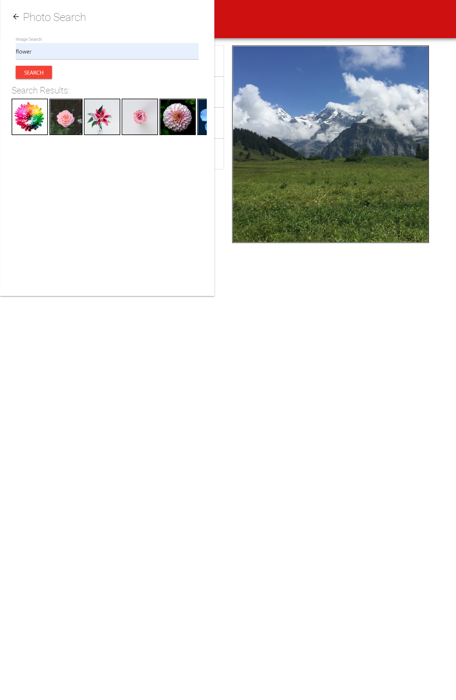
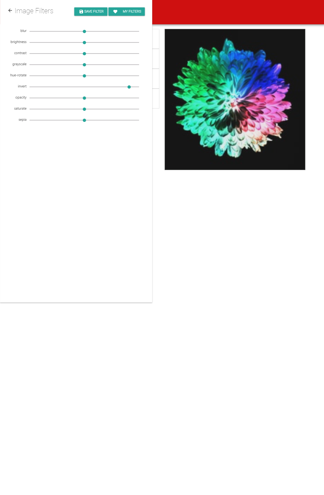
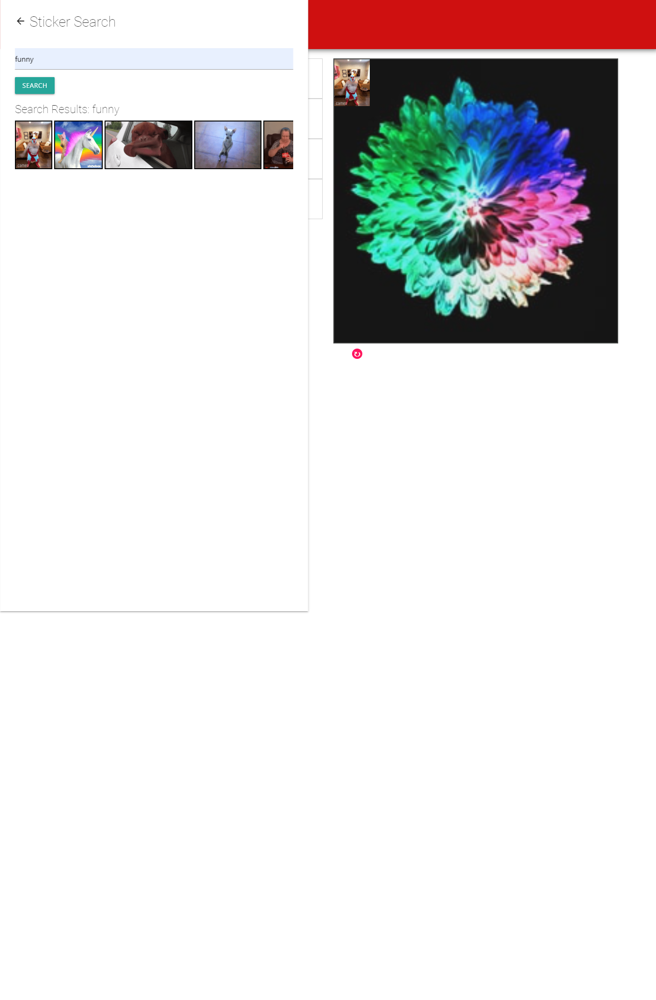
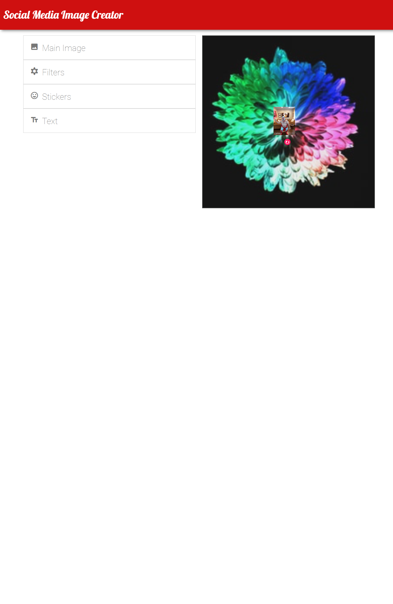
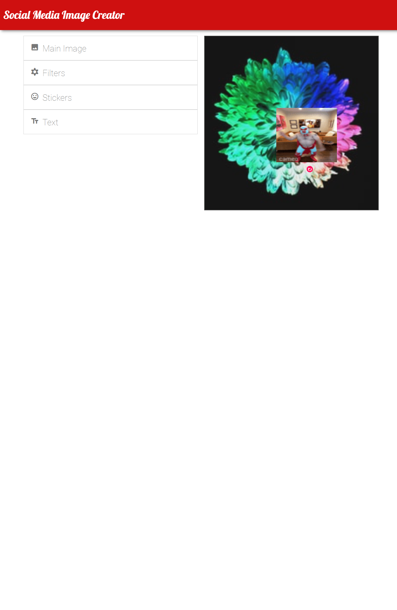
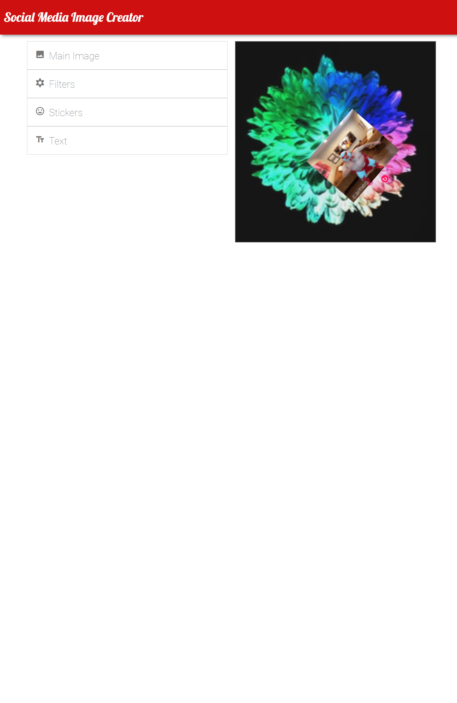

# image-creator
Create and customize images for social media posts with giphy &amp; unsplash

## Libraries

### Materialize
This project utilizes the materialize css library based on google's Material Design Library

### interact.js
This project uses the interact.js library to include reposition, resize, and rotation functions with the gifs.

### jQuery
jQuery was utilized to shorten code and work with both materialize and interact.js.

## Description
The motivation behind developing this application was to create and image editor that is multiplatform cababilities for various social media sites. The app allows for API calls to unsplash for the background image. This allows for a lot of customizability. It also utilizes a giphy API call to generate and apply any amount of gifs to the background image. With the use of interact.js, the gifs can be repositioned, resized, and rotated for more customizability. Unwanted gifs can be dropped under the bottom of image contaienr to delete. With css-filters and materialize css, The background image can be altered with various sliders, then saved locally. During this project, I learned how to work with the interact.js library. I previously had no expierence with the library, but with the help of the docs and devs github, I was able to apply the UI components to the gifs. 

## Table of Contents
- [image-creator](#image-creator)
  - [Libraries](#libraries)
    - [Materialize](#materialize)
    - [interact.js](#interactjs)
    - [jQuery](#jquery)
  - [Description](#description)
  - [Table of Contents](#table-of-contents)
  - [Installation](#installation)
  - [Usage](#usage)
  - [Credits](#credits)
  - [License](#license)
  - [Features](#features)
  - [How to Contribute](#how-to-contribute)

## Installation
N/A

## Usage
The link to the deployed site is here. [image-creator](https://maxstump13.github.io/image-creator/)

When the page is first loaded, this is the home screen.
 

From here, the user can select a background image via a search bar to the unsplash API. As shown below, there is a functioning sidescroll bar. To make the desired image populate the image container, just click. 

After an image is selected, the user can apply filters via the filter sidebar scrollers. The user then has the option to save the settings locally.

Next the user has the option to add gifs via the sticker sidebar menu via a Giphy API call. The user can add them by just clicking. Once added, the user can also reposition, resize, and rotate the images. Drag and drop functions work when the gif is clicked and held in the middle of the gif. The resize feature works from the bottom and ride sides/edge of the gif. The rotation function is activated by clicking the red rotation arrow. These steps are displayed below in a series of images.

To remove an unwanted gif, simply drag the gif under the image container and it will be deleted.

## Credits
List your collaborators, if any, with links to their GitHub profiles.
If you used any third-party assets that require attribution, list the creators with links to their primary web presence in this section.
If you followed tutorials, include links to those here as well.
- [Maximilian Stump](https://github.com/MaxStump13)
- [Bonnie DiPasquale](https://github.com/bvasko)
- [Warren Haskins](https://github.com/warrenhaskins1)
1. [interact.js](https://interactjs.io/)
2. [Materialize](https://materializecss.com/about.html)
3. [jQuery](https://api.jquery.com/)
4. [giphy](https://developers.giphy.com/)
5. [alligator.io](https://alligator.io/js/drag-and-drop-interactjs/)
6. [codepen](https://codepen.io/taye/pen/wrrxKb)
7. [Plnkr](https://embed.plnkr.co/g81ZqmXFwAZXnqeijIEX/)
8. [hacks.mozilla](https://hacks.mozilla.org/2014/11/interact-js-for-drag-and-drop-resizing-and-multi-touch-gestures/)
9. [taye](https://github.com/taye/interact.js)
10. [jsfiddle](https://jsfiddle.net/axnyfuj8/1/)
11. [unsplash](https://unsplash.com/developers)
12. [softauthor](https://softauthor.com/javascript-working-with-images/)
13. [encodedna](https://www.encodedna.com/css-tutorials/add-text-to-image-and-save-the-image.htm)
14. [imgix](https://docs.imgix.com/apis/rendering)
15. [CSS-Tricks: Apply a filter to a background image](https://css-tricks.com/apply-a-filter-to-a-background-image/)
## License
MIT License

Copyright (c) [2022] [Maximilian Stump]

Permission is hereby granted, free of charge, to any person obtaining a copy
of this software and associated documentation files (the "Software"), to deal
in the Software without restriction, including without limitation the rights
to use, copy, modify, merge, publish, distribute, sublicense, and/or sell
copies of the Software, and to permit persons to whom the Software is
furnished to do so, subject to the following conditions:

The above copyright notice and this permission notice shall be included in all
copies or substantial portions of the Software.

THE SOFTWARE IS PROVIDED "AS IS", WITHOUT WARRANTY OF ANY KIND, EXPRESS OR
IMPLIED, INCLUDING BUT NOT LIMITED TO THE WARRANTIES OF MERCHANTABILITY,
FITNESS FOR A PARTICULAR PURPOSE AND NONINFRINGEMENT. IN NO EVENT SHALL THE
AUTHORS OR COPYRIGHT HOLDERS BE LIABLE FOR ANY CLAIM, DAMAGES OR OTHER
LIABILITY, WHETHER IN AN ACTION OF CONTRACT, TORT OR OTHERWISE, ARISING FROM,
OUT OF OR IN CONNECTION WITH THE SOFTWARE OR THE USE OR OTHER DEALINGS IN THE
SOFTWARE.

## Features
1. Interactive sidenav for all options
2. Unsplash image and Giphy sticker API calls with scoll menu
3. CSS Filters appliable to image container with working sliders for intensity
4. Gif drag/drog, resize, and rotation features
5. Locally storing previous filters in filters sidenav

## How to Contribute
If there are any suggestions to improve this generator, this is my [GitHub profile](https://github.com/MaxStump13) account. The repo can be found at, [Github repo](https://github.com/MaxStump13/image-creator).